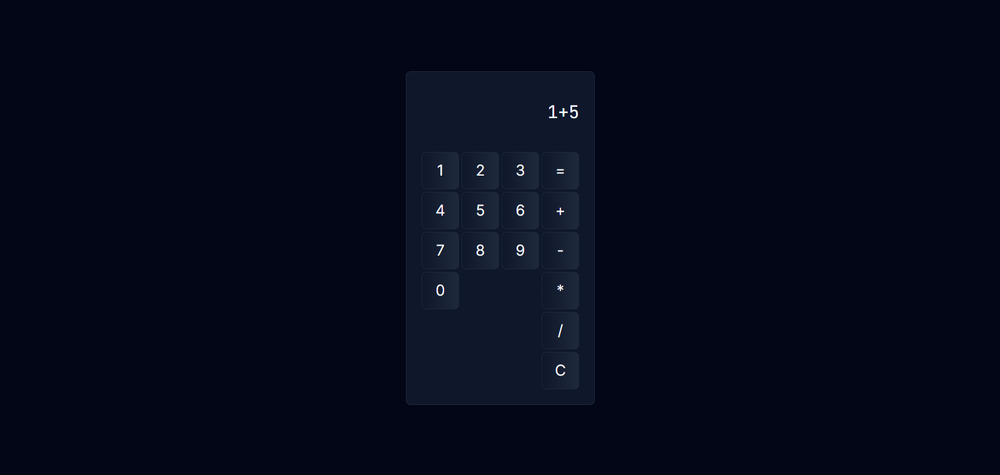

# Calculadora Simples

## Demonstração

Você pode visualizar uma demonstração da calculadora [aqui](link_para_demo).

Esta é uma aplicação de calculadora simples desenvolvida em HTML, CSS e JavaScript. A calculadora permite a realização de operações matemáticas básicas, como adição, subtração, multiplicação e divisão, tanto por meio de cliques nos botões quanto pelo teclado.

## Funcionalidades

- **Botões de Números:** Botões numerados de 0 a 9 que permitem a inserção de números no visor da calculadora.
- **Botões de Operadores:** Botões de operadores matemáticos (+, -, *, /) para realizar as operações desejadas.
- **Botão de Igual (=):** Botão de igual que calcula a expressão matemática inserida no visor.
- **Botão de Limpar (C):** Botão de limpar que limpa o visor da calculadora.
- **Teclado:** Permite inserir números e operadores matemáticos usando o teclado.
- **Notificações:** Exibe uma notificação quando o resultado é copiado para a área de transferência.

## Estrutura do Projeto

- **HTML:** O arquivo HTML (`index.html`) contém a estrutura da calculadora.
- **CSS:** O arquivo CSS (`style.css`) contém os estilos para a interface da calculadora.
- **JavaScript:**
  - `script.js`: Arquivo principal que importa e executa os módulos necessários para o funcionamento da calculadora.
  - `calculate.js`: Contém funções para realizar cálculos matemáticos, limpar o visor e exibir o resultado.
  - `buttonPanel.js`: Define o comportamento dos botões da calculadora quando clicados.
  - `keyboard.js`: Define o comportamento da calculadora quando as teclas do teclado são pressionadas.
  - `copyToClipboard.js`: Função para copiar o resultado para a área de transferência.
  - `setNotification.js`: Função para exibir notificações quando o resultado é copiado.

## Como Executar

1. Baixe os arquivos do repositório para o seu computador.
2. Abra o arquivo `index.html` em seu navegador da web.

## Autor

Desenvolvido por [Ariel]([link_para_perfil_github](https://github.com/ArielAlael)).
